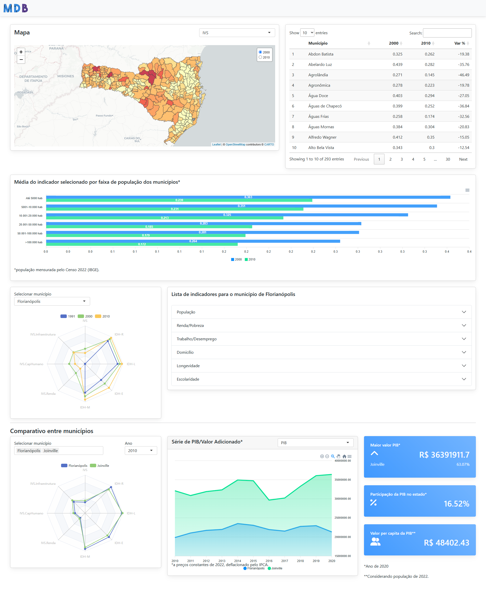

# A Shiny dashboard from MDB Template



## About this repository 

The main goal of this project is to share a example of Shiny aplication using [MDB](https://mdbootstrap.com/) bootstrap as a front-end framework.
The graphs have been created utilizing _echarts_ and _apexcharts_ JS libraries.

Bellow shows the manner how this page is structured

```
shiny_MDB/
├── README.md
├── www/
│   ├── apexchart/
│   ├── css/
│   ├── echarts/
│   ├── images/
│   └── JS
├── data/ 
├── ui.R
├── server.R
└── treating_data.R
```
